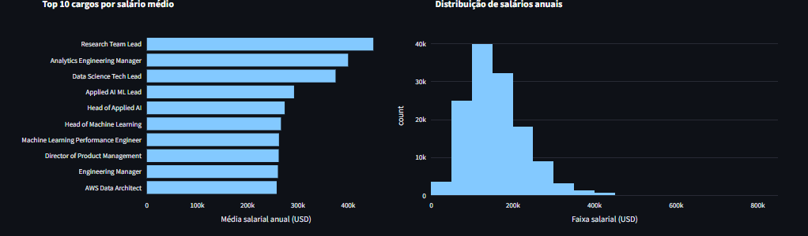
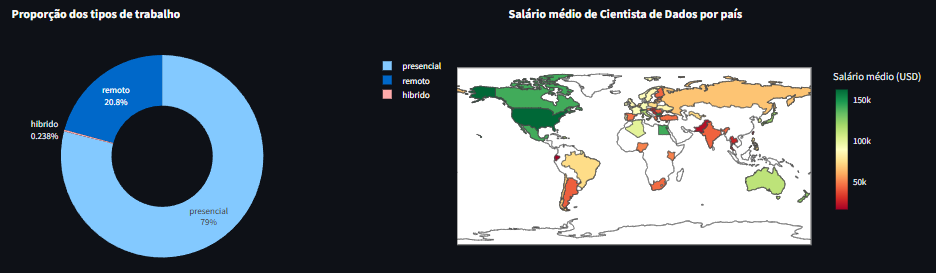

  

<h1 align="center">Olá, eu sou a Biatrice 👋</h1>

Analista de Dados em Evolução • Python • SQL • Análise Exploratória

---

##  ⭐ Sobre mim

Sou uma **Analista de Dados em evolução**, com foco em transformar dados em informações claras e acionáveis.  
Tenho interesse especial em **análise exploratória**, **organização de dados**, **visualização** e **resolução de problemas com base em dados**.

Atualmente, estudo e aplico conceitos de **Python para análise de dados**, **SQL**, estatística básica e boas práticas de organização e documentação de projetos.

Busco oportunidades para aprender, colaborar e evoluir continuamente na área de dados.

---

## 🛠️ Tecnologias e Ferramentas

- **Linguagens:** Python, SQL  
- **Bibliotecas:** Pandas, NumPy, Matplotlib, Seaborn  
- **Conceitos:**  
  - Análise Exploratória de Dados (EDA)  
  - Limpeza e tratamento de dados  
  - Visualização de dados  
  - Métricas e interpretação de resultados  
- **Ferramentas:** Git, GitHub, Jupyter Notebook, Streamlit

---

## 📊 O que você vai encontrar aqui

- Projetos práticos de análise de dados  
- Estudos e experimentos com Python  
- Exercícios comentados e organizados  
- Análises com foco em clareza e interpretação  

Cada repositório representa um passo na minha evolução como analista.

---

📂 Projetos em Destaque

### 📊 Análise de Salários na Área de Dados
Dashboard interativo desenvolvido em Python com Streamlit para explorar dados salariais.

🔧 Tecnologias: Python, Pandas, Streamlit  
📈 Destaques:
- Filtros por cargo e país  
- Gráficos interativos  
- Análise exploratória dos dados  

[LinkedIn](www.linkedin.com/in/biatrice) | ✨ Obrigada por visitar meu perfil!
